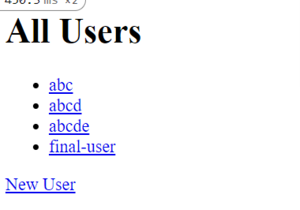
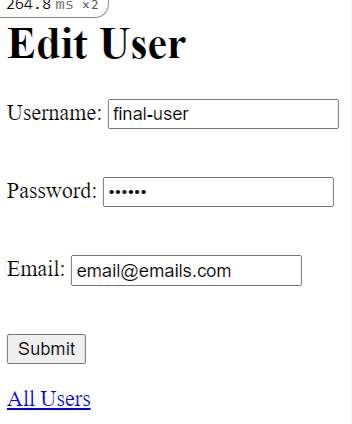
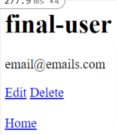
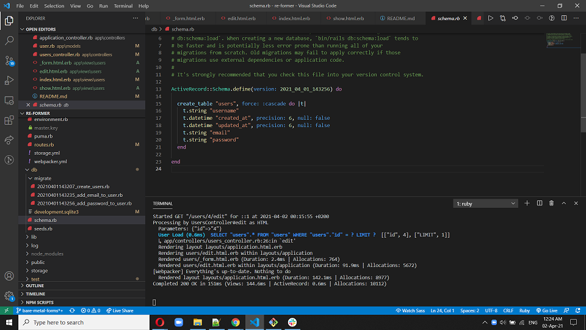

# Project : Forms in Rails

> The project aims to provide a deeper understanding on Forms in Rails. Associations are very simple and illustrated below:
- User 






## Built With

- Ruby on Rails
- Active Records
- Forms & Helpers
## Getting Started

Model generated:

- user
 - Create
 - Edit
 - Delete
 - List

### Requirements
- 1. Ruby (~v2.6.3 or more recent) installed in your machine.
- 2. Rails

### Setup

* To clone this repository, open your Terminal and execute the following command:
```
git clone https://github.com/smy5152/re-former.git
```

### Run
* Change into the folder
```
cd re-former
```
* Install gems
```
bundle install
```
* Run Database migrations
```
rails db:migrate
```

### How to use it

* Run Rails console
```
rails console
```

> To start testing the models, execute the following commands from the Rails console.
> We have added some default content in each Model.

- User.all

## Authors

🧑‍💻 **Shabbir**

- GitHub: [@smy5152](https://github.com/smy5152)
- Twitter: [@smy5152](https://twitter.com/smy5152)
- LinkedIn: [Shabbir Yamani](https://www.linkedin.com/in/shabbirmyamani/)

## 🤝 Contributing

Contributions, issues, and feature requests are welcome!

Feel free to check the [issues page](https://github.com/issues).

## Show your support

Give a ⭐️ if you like this project!

## Acknowledgments

- [Micoverse team](https://microverse.pathwright.com/library/fast-track-curriculum/69047/path/step/49722685/)

## 📝 License

This project is [MIT](https://opensource.org/licenses/MIT) licensed.
